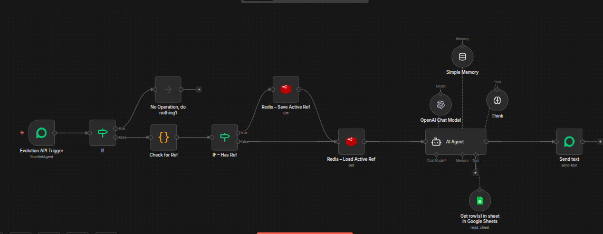

# WhatsApp AI Booking Assistant for Shortlet Rentals (n8n Automation)

AI-powered WhatsApp front desk assistant built with n8n that automates shortlet booking conversations.

The system handles apartment inquiries, retrieves listing data from Google Sheets, maintains conversation context with Redis, and guides guests through the booking process using an AI agent.

## Workflow Canvas

## Stack

- n8n
- Evolution API (WhatsApp)
- OpenAI
- Redis
- Google Sheets

## Features

- WhatsApp conversation automation
- Apartment availability checks
- AI-powered responses
- Booking qualification
- Payment instruction generation

## Workflow Architecture

This workflow processes WhatsApp messages and manages the booking conversation using AI.

Flow:
WhatsApp Message  
→ Evolution API Trigger  
→ Message Filter (Ignore messages sent by the bot)  
→ Message Parser (Extract listing reference)  
→ Redis State Manager (Store active apartment reference)  
→ AI Agent  
→ Google Sheets Listing Database  
→ AI Response  
→ Send WhatsApp Reply

## Key Workflow Components

**Evolution API Trigger**  
Receives incoming WhatsApp messages.

**Message Parser (Code Node)**  
Extracts listing references from messages (e.g. REF=L001).

**Redis State Manager**  
Stores the active apartment reference for each conversation.

**AI Agent**  
Handles natural language conversation and booking flow.

**Google Sheets Tool**  
Retrieves apartment data from the listing database.

**Send Text Node**  
Delivers the AI-generated response back to the guest on WhatsApp.

## Note

This repository contains the workflow structure only.

API keys, tokens, and credentials are **not included** for security reasons.  
You must provide your own credentials when importing the workflow into n8n.
## Credentials Setup

After importing the workflow into n8n, you must configure the required credentials.

The workflow requires the following services:

- Evolution API (WhatsApp)
- OpenAI API
- Redis
- Google Sheets API

Steps:

1. Import the workflow JSON into n8n
2. Open each node that shows a credential warning
3. Add your own credentials for the required services
4. Activate the workflow

Once credentials are configured, the workflow will run normally.
